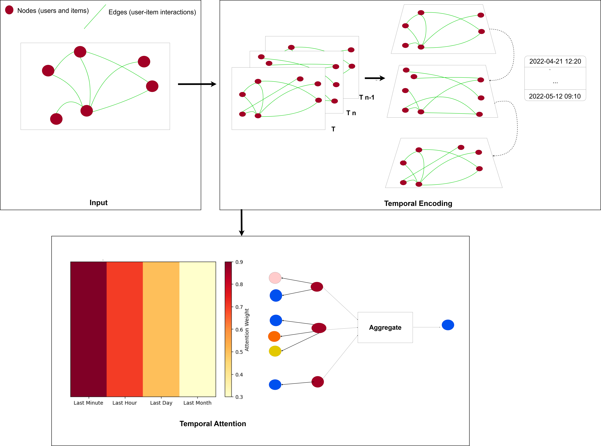

# HTGNN: Hierarchical Time-aware Graph Neural Networks for Recommender Systems



**HTGNN** is a novel graph-based neural architecture designed to incorporate **multi-scale temporal dynamics** for enhanced recommendation accuracy. By modeling user-item interactions across hierarchical time granularities, HTGNN effectively captures both short-term and long-term user behavior patterns.

---

##  Features

- Supports **multi-granular timestamp modeling** (day, hour, minute)
- Combines **GCN layers with temporal embeddings**
- Evaluated on 5 real-world datasets: MovieLens, Amazon, Houses, Last.FM, and Retailrocket
- Supports evaluation metrics: `NDCG@10`, `Precision`, `Recall`, `F1`

---

##  Datasets

This implementation supports the following datasets:

- [MovieLens (small)](https://www.kaggle.com/datasets/rounakbanik/the-movies-dataset)
- [Amazon Ratings](https://www.kaggle.com/datasets/skillsmuggler/amazon-ratings)
- [Houses](https://www.kaggle.com/datasets/arashnic/property-data)
- [Last.FM](https://www.kaggle.com/datasets/harshal19t/lastfm-dataset)
- [Retailrocket](https://www.kaggle.com/datasets/retailrocket/ecommerce-dataset)

Please place the CSV files in the appropriate `data/` directory after download.

---

##  Installation

```bash
git clone https://github.com/raniaabidi/HTGNNs.git
cd HTGNNs
pip install -r requirements.txt
